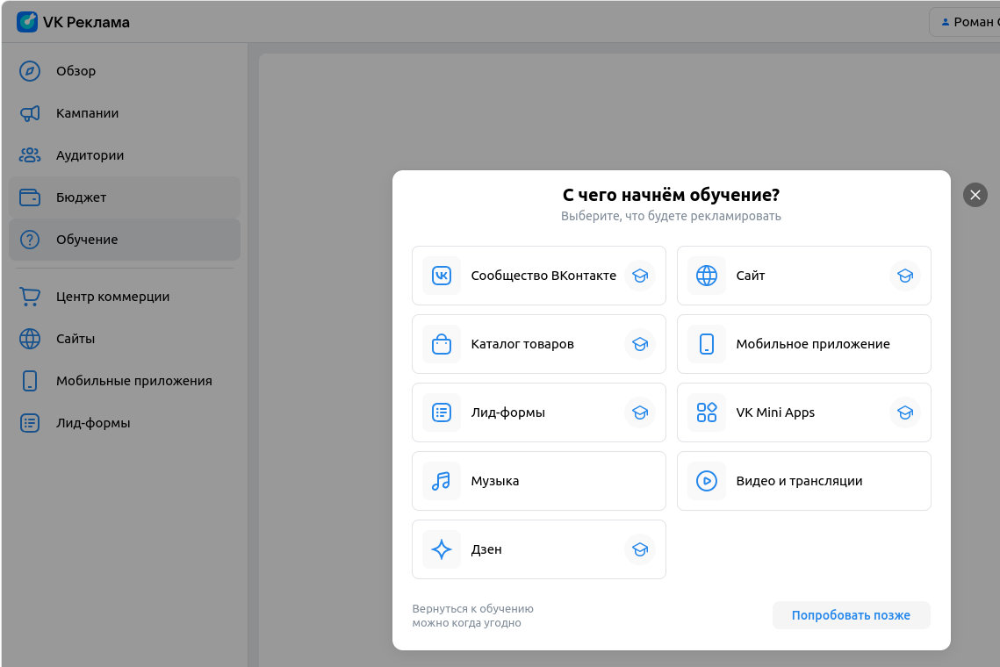

# Домашнее задание 3

## **Чек-листы** на проект [VK Реклама](https://ads.vk.com)

## Обучение

- При нажатии на кнопку "Обучение" открывается соответствующее модальное окно.

## Страница обучения

- При нажатии на первое поле из списка, открывается выбранное поле.
- При нажатии на крестик, страница обучения закрывается.
- При нажатии на кнопку "Попробовать позже", страница обучения закрывается.
- При нажатии вне модального окна, страница обучения закрывается.
- При нажатии на Esc на клавиатуре, страница обучения закрывается.

### Страница обучения. Сообщество ВКонтакте

- **Баг.**
  Страница обучения. Сообщество ВКонтакте. При нажатии на кнопку "Настроить кампанию с подсказками" -> "Создать кампанию" и после этого вернуться на страницу назад, то всплывающее окно не исчезает, возможности закрыть нет, все остальное становится некликабельным.

- Страница обучения. Сообщество ВКонтакте. При нажатии на кнопку "Настроить кампанию с подсказками" открывается гайд по настройке.

#### Страница обучения. Сообщество ВКонтакте. Настроить кампанию с подсказками.

- При нажатии на "Рекламируемый объект" появляется список доступных сообществ.

- Бюджет. При вводе цифр, они отображаются в поле. Другие символы не отображаются.

- Календарь. При нажатии на стрелку влево месяц изменится на предыдущий.

- Календарь. При нажатии на стрелку вправо месяц изменится на следующий.

#### Страница обучения. Сообщество ВКонтакте. Смотреть видеоурок.

- При нажатии на "Смотреть видеоурок" открывается плеер.

- При нажатии на плеер видео запускается.

- При нажатии вне плеера видео закрывается.

- При нажатии на крестик видео закрывается.

#### Страница обучения. Сообщество ВКонтакте. Смотреть курс.

- При нажатии на кнопку "Смотреть курс" открывается статья с соответствующей информацией.

### Страница обучения. Каталог товаров

- При нажатии на крестик окно закрывается.

#### Страница обучения. Каталог товаров. Создать каталог.

- При нажатии на "Создать каталог" открывается гайд по созданию нового каталога.

- Новый каталог. Ссылка на страницу продавца. При вставке корректной ссылки появляется возможность продолжить подготовку каталога.

- Новый каталог. Ссылка на страницу продавца. При вставке некорректной ссылка ничего не происходит.

#### Страница обучения. Каталог товаров. Смотреть видеоурок.

- При нажатии на "Смотреть видеоурок" открывается плеер.

- При нажатии на плеер видео запускается.

- При нажатии вне плеер видео закрывается.

- При нажатии на крестик видео закрывается.

#### Страница обучения. Каталог товаров. Смотреть курс.

- При нажатии на кнопку "Смотреть курс" открывается статья с соответствующей информацией.

### Страница обучения. Лид-формы.

- При нажатии на крестик окно закрывается.

#### Страница обучения. Лид-формы. Настроить кампанию.

- При нажатии на "Настроить кампанию" происходит переход на гайд по настройке кампании.

#### Страница обучения. Лид-формы. Создать лид-форму.

- При нажатии на "Создать лид-форму" происходит переход на гайд по настройке кампании.

- Создать лид-форму. Загрузка изображения. Изображение, не превышающее размер 256 на 256 пикселей загружается успешно.

- Создать лид-форму. Загрузка изображения. Изображение, не превышающее размер 256 на 256 пикселей загружается успешно.

- Создать лид-форму. Название компании. При вводе названия, оно сохраняется и отображается на превью.

- Создать лид-форму. Название компании. При вводе слишком короткого названия, недоступно дальнейшее заполнение.

- **Баг** Создать лид-форму. Название компании. При вводе слишком длинного названия, дальнейшее заполнение доступно.

- Создать лид-форму. Лид-форма отображается корректно.

- **Баг** Создать лид-форму. Предпросмотр. Невозможно ввести имя.

#### Страница обучения. Лид-формы. Смотреть видеоурок.

- При нажатии на "Смотреть видеоурок" открывается плеер.

- При нажатии на плеер видео запускается.

- При нажатии вне плеер видео закрывается.

- При нажатии на крестик видео закрывается.

#### Страница обучения. Лид-формы. Смотреть курс.

- При нажатии на кнопку "Смотреть курс" открывается статья с соответствующей информацией.

### Страница обучения. Музыка.

- При нажатии на крестик окно закрывается.

#### Страница обучения. Музыка. Смотреть видеоурок.

- При нажатии на "Смотреть видеоурок" открывается плеер.

- При нажатии на плеер видео запускается.

- При нажатии вне плеер видео закрывается.

- При нажатии на крестик видео закрывается.

#### Страница обучения. Музыка. Смотреть курс.

- При нажатии на кнопку "Смотреть курс" открывается статья с соответствующей информацией.
